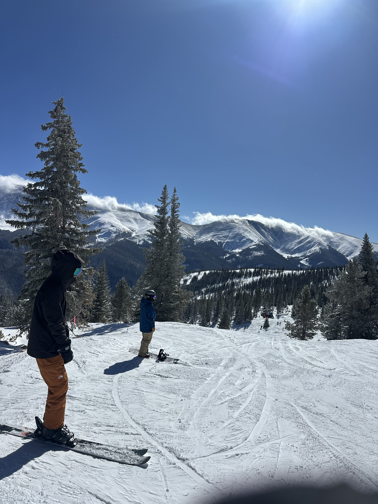
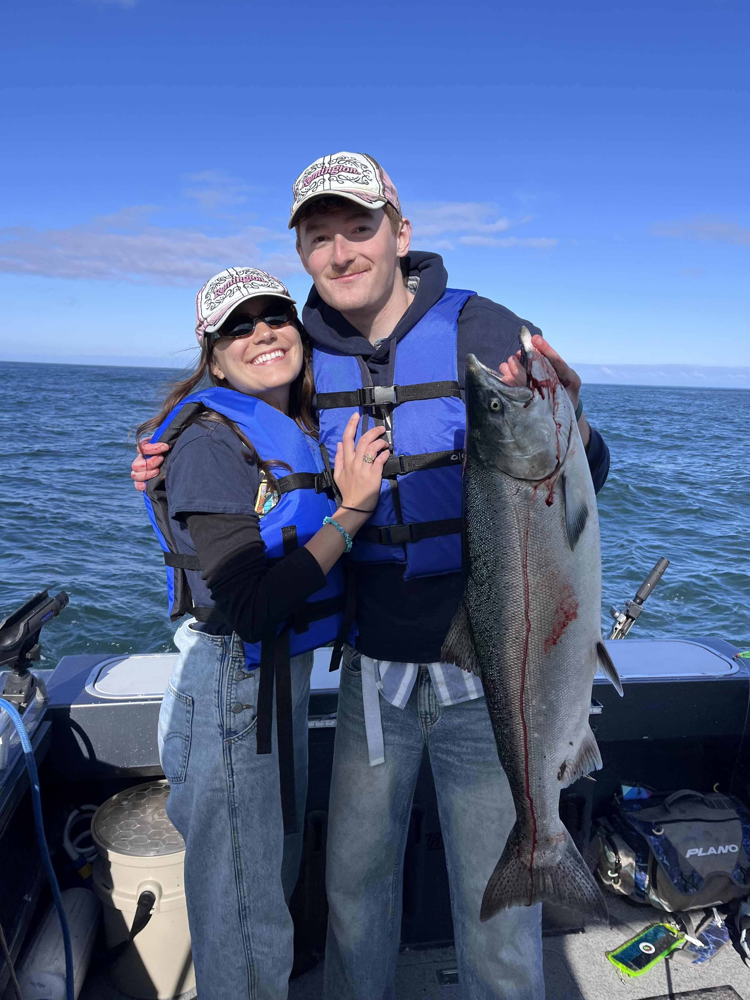
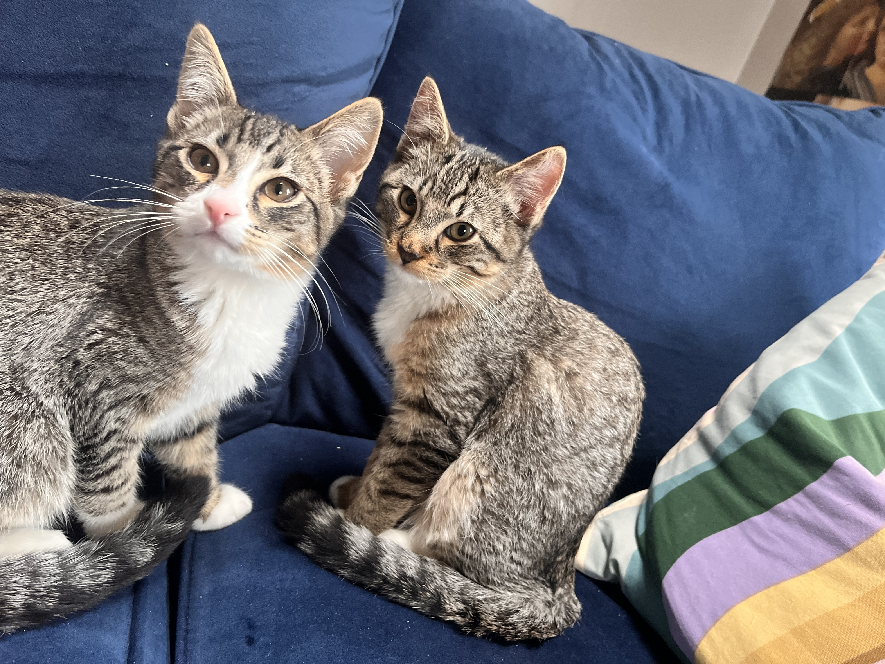
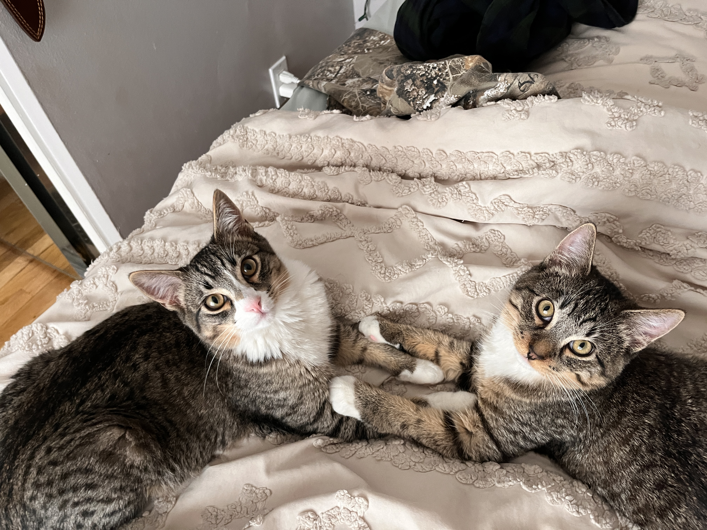

# Hi. I'm Griffin. Thanks for visiting my GitHub. Scroll down to learn about me more in a more personalized fashion than you will on any other of my social medias.

```
              ╔══════════════════════════════════════════════════╗
              ║                                                  ║
              ║   "Earning trust through competence and care."   ║
              ║                                                  ║
              ╚══════════════════════════════════════════════════╝
```

**CS × Finance · Denver, CO · University of Denver '26 / '27**

Thanks to my Computer Science backgroud and the advent of my good friend AI (Claude) I feel comfortable vibe-coding and deploying a wide range of software solutions. Exciting me most is software that automizes the "computer" work of a financial advisor. Essentially, I imagine a world where a financial advisor click-clacking around on their desktop to be a thing of the past. Instead the advisor will spend the majority of their day meeting in-person with clients to deliver the personalized care that **should** come when the client is trusting their advisor with their life's savings. In this future, a private, tailored AI will be privy to all details of the advisor's clients, and the AI will work to develop investment, tax, estate, etc. planning while the advisor is out in the field meeting and connecting with clients. Finally, the advisor will review the planning of its friendly-AI and sign off on its work. 

In ten years I plan to be running a financial-advising firm in which I have devloped and implemented powerful automation tools that enable my team of advisers to focus entirely on delivering the best-in-class client service. That's a big goal, though I am confident my education, vision, and values will take me to these heights.

---

### 🔧 What I'm Building

**Portfolio Rebalancing Engine** — A Python-based trade automation system for an independent financial advisory firm. Reads client holdings, generates optimized buy/sell orders, manages cash equivalents, and ships as a standalone Windows executable with CI/CD via GitHub Actions.

**Compiler for N1/Ni** — A from-scratch compiler in Haskell covering uniquification, RCO, explicate control, and instruction selection. Built as part of DU's Compiler Design course.

**Equity Research Toolkit** — Python + Polygon.io pipeline for analyzing trade performance, computing risk-adjusted returns, and generating analyst leaderboards with Sharpe ratios and win rates.

**GenAI/NLP Projects** — RAG pipelines, dense retrieval with FAISS, semantic search (BM25 vs. dense), CLIP-based image retrieval, and LLM-powered text classification.

---

### 🧰 Toolbox

```
Languages      Python · Haskell · SQL · Java · C++ · JavaScript
Finance        Equity Valuation · Options Pricing · FX Hedging · Portfolio Theory
ML / NLP       RAG · FAISS · Cohere Embeddings · CLIP · Few-Shot Prompting
Infrastructure PyInstaller · GitHub Actions · Git · Linux
Parallel       OpenMP · OpenCL · TCP Sockets · Distributed Systems
```

---

### 📍 Beyond the Keyboard

When I'm not writing code or reading 10-Ks, you'll find me:

<p align="center">
  &nbsp;&nbsp;
  &nbsp;&nbsp;
  
</p>

🏔️ Skiing Colorado (and the East!) · 🐟 Catching salmon · 🏕️ Leading backcountry expeditions in the White Mountains

---

### 🐱 Norman and Sabrina

<p align="center">
  &nbsp;&nbsp;
  
</p>

I spent 8 months fostering many different kittens from the Denver Animal Shelter. After fostering these two for a week, they were too perfect to give back, so I foster-failed and adopted them.

---

### 🗺️ Thanks for reading.

If you'd like to know anything more, or connect in depth, send me an email!

---

### 📫 Let's Connect

[](https://www.linkedin.com/in/Griffin-Stoddard)
[](mailto:griffinjstoddard@gmail.com)

---
<p align="center"><sub>Built with ☕ and conviction — last updated March 2026</sub></p>
